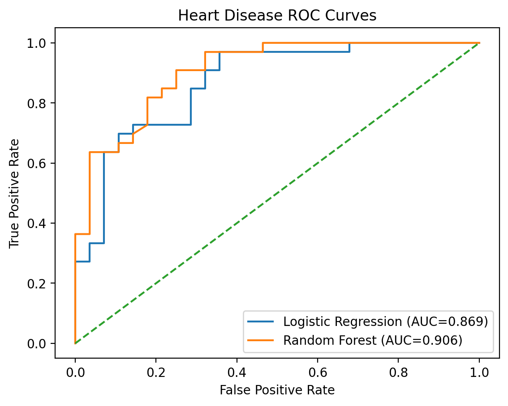

# Reproducible Clinical Machine Learning Pipeline: Heart Disease Prediction

This repository presents a compact research-style machine learning pipeline for cardiovascular disease prediction using a publicly available clinical dataset.  
The project demonstrates reproducible dataset ingestion, preprocessing, model training, cross-validated evaluation, and ROC-based performance analysis using Logistic Regression and Random Forest classifiers.

The repository is structured to resemble a lightweight experimental research prototype suitable for rapid benchmarking of biomedical datasets.

## Methods
- Dataset: Public clinical heart disease dataset (OpenML)
- Models: Logistic Regression (linear baseline) and Random Forest (nonlinear ensemble)
- Evaluation: 80/20 train–test split with 5-fold cross-validation
- Metrics: Accuracy and ROC-AUC
- Visualization: ROC curve comparison and feature importance plots

## Results
Both models demonstrated stable cross-validated performance (~0.83 mean accuracy).  
The Random Forest achieved slightly higher test performance (Accuracy ≈ 0.82, AUC ≈ 0.91) compared to Logistic Regression (Accuracy ≈ 0.80, AUC ≈ 0.87), suggesting moderate nonlinear relationships within the clinical predictors.

### ROC Curve Comparison



## Run locally
```bash
python -m venv .venv
source .venv/bin/activate
pip install -r requirements.txt
jupyter lab
